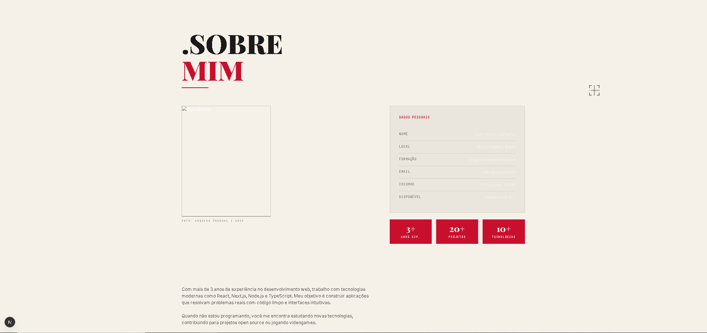
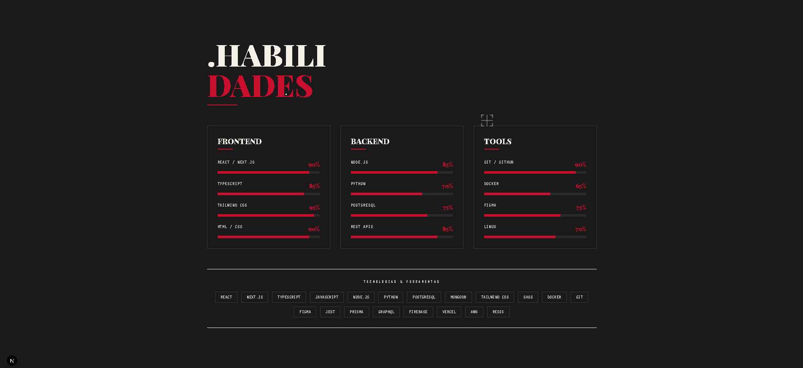
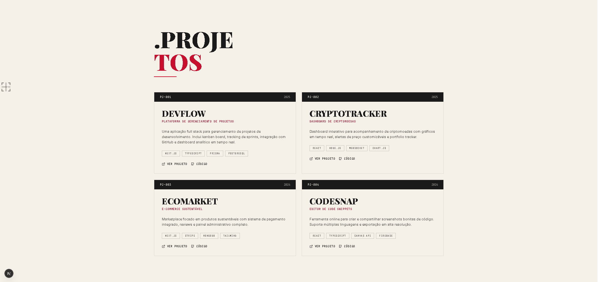
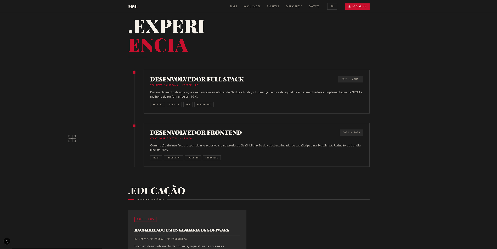

  <h1>🚀 DevProfile – Portfólio Profissional</h1>
  
  

    Website de portfólio moderno, responsivo e acessível para apresentar trajetórias, habilidades e projetos.
  

  
  
  
  

---

> [!NOTE]
> **DevProfile** é um projeto desenvolvido como atividade prática de laboratório. O objetivo central é entregar uma plataforma de alta performance para desenvolvedores exibirem seu trabalho de forma profissional.

<table>
  <tr>
    <td width="800px">
      

        Este <b>README.md</b> documenta as tecnologias e instruções básicas do projeto <b>DevProfile</b>. Ele foi estruturado seguindo as boas práticas recomendadas para projetos acadêmicos e profissionais, garantindo <i>organização clara</i> e <i>reprodutibilidade</i>.
      

    </td>
    <td>
      

        
      

    </td>
  </tr> 
</table>

---

## 🔗 Links Principais

* 🎨 **Protótipo no Figma:** [Acessar Design do Portfólio](https://www.figma.com/site/5uJwViQDZvkjFkw1QgB3hw/portifolio?node-id=0-1&t=inUnvzpmFWvPnJtW-1)
* 🌐 **Site Publicado (Produção):** [Indisponível](COLE_AQUI_O_LINK_DA_VERSAO_EM_PRODUCAO)

---

## 📝 Sobre o Projeto

O **DevProfile** nasceu da necessidade de centralizar a identidade profissional de desenvolvedores de software em um único lugar. Em um mercado de tecnologia competitivo, ter um portfólio rápido, acessível e visualmente agradável é fundamental para se destacar em processos seletivos e apresentar projetos acadêmicos.

Este projeto foca em entregar uma experiência de navegação fluida, construída com as ferramentas mais modernas do ecossistema front-end.

---

### 📂 Estrutura de Pastas Principais

* `/app`: Contém as rotas e componentes de página (Next.js App Router).

* `/components`: Componentes React reutilizáveis da interface.

* `/hooks`: Hooks customizados para lógica de estado.

* `/lib`: Funções utilitárias e configurações de bibliotecas externas.

* `/styles`: Arquivos de configuração de estilo e CSS global.

<!-- Este template foi criado para servir como referência e pode ser facilmente adaptado para diferentes projetos de desenvolvimento -->

<!--  

-->

 

---

# 🎥 Demonstração

## 🌐 Aplicação Web

| Sobre mim | Habilidades |
|:------:|:------:|
|  |  |

| Projetos | Experiência |
|:------:|:------:|
|  |  |

---

## 🛠 Tecnologias Utilizadas

* **[React](https://react.dev/)** - Biblioteca JavaScript para construção de interfaces de usuário.
* **[Next.js (App Router)](https://nextjs.org/)** - Framework React com suporte a renderização do lado do servidor (SSR).
* **[TypeScript](https://www.typescriptlang.org/)** - Adiciona tipagem estática e segurança ao código JavaScript.
* **[Tailwind CSS](https://tailwindcss.com/)** - Framework CSS utilitário para criação de interfaces responsivas de forma rápida.
* **[pnpm](https://pnpm.io/)** - Gerenciador de pacotes rápido e eficiente em termos de espaço em disco.
* **[Vercel](https://vercel.com/)** - Plataforma utilizada para o deployment e infraestrutura do projeto.

---

## 👥 Autores

Liste os principais contribuidores. Você pode usar links para seus perfis.

| 👤 Nome | 🖼️ Foto | :octocat: GitHub | 💼 LinkedIn | 📤 Gmail |
|---------|----------|-----------------|-------------|-----------|
| Davi Nunes Carvalho | 

 | 

 | 

 | 

 |
| Matheus Henrique Tavares Malta Soares | 

 | 

 | 

 | 

 |
| João Victor Russo Marquito | 

 | 

 | 

 | 

 |

---
## 🙏 Agradecimentos

Gostaríamos de agradecer às seguintes pessoas e instituições que contribuíram para o nosso aprendizado ao longo do desenvolvimento:

* [**Engenharia de Software PUC Minas**](https://www.instagram.com/engsoftwarepucminas/) - Pelo apoio acadêmico.
* [**Prof. Dr. João Paulo Aramuni**](https://github.com/joaopauloaramuni) - Pelas diretrizes de documentação e boas práticas de desenvolvimento.
